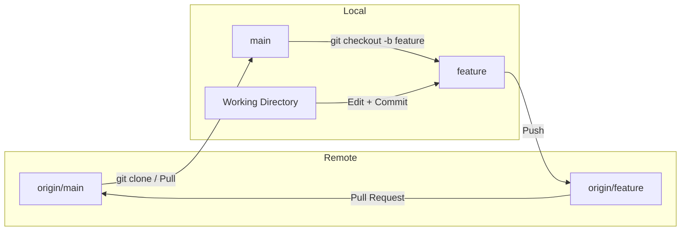

# Git Commands Cheat Sheet

## 🟢 Basics

- `git help [command]`  
  コマンドのヘルプを表示

### Terminology
| 用語   | 意味                                   |
| ------ | -------------------------------------- |
| main   | デフォルトのメインブランチ             |
| origin | デフォルトのアップストリームリポジトリ |
| HEAD   | 現在のブランチ                         |
| HEAD^  | HEADの親                               |
| HEAD~3 | HEADの3つ前の祖先                      |

---

## 🚀 Image




---

## 🔧 基本操作 (Basic Commands)

```bash
git init                    # 新しいGitリポジトリを初期化
git clone <repo_url>       # リモートリポジトリをクローン
git status                 # 作業ツリーの状態を確認
git add <file>             # ファイルをステージング
git commit -m "message"    # ステージされた変更をコミット
git push                   # ローカルの変更をリモートへ送信
git pull                   # リモート変更を取得＆マージ
git diff                   # 作業中の差分を表示
git diff --staged          # ステージされた差分を表示
```

---

## 🌿 ブランチ管理 (Branching & Workflow)

```bash
git branch                       # ローカルブランチ一覧
git branch -all                  # ローカルとリモートのブランチをすべて表示
git branch <branch_name>        # 新しいブランチを作成
git checkout <branch_name>      # 既存のブランチに切り替え
git checkout -b <branch_name>   # 作成して即切り替え
git merge <branch_name>         # 指定ブランチを現在のブランチにマージ
git merge hotfix                # hotfixの変
git branch -d <branch_name>     # マージ済みブランチの削除
git branch -D <branch_name>     # 強制削除
git log --graph --oneline       # 簡易かつ視覚的な履歴表示
```

---

## 🔄 同期と履歴管理 (Synchronization & History)

```bash
git fetch                        # リモートから変更を取得（マージなし）
git pull --rebase                # 変更を取得してリベース
git rebase <branch>              # 指定ブランチにリベース
git remote add <name> <url>     # 新しいリモートを追加
git reflog                       # HEADやブランチ移動の履歴を確認
git log --oneline                # コミット履歴を一行表示
git log --graph --decorate --all # グラフ形式で全ブランチ履歴表示
```

---

## ⚔️ コンフリクト解消 (Conflicts)

```bash
git diff                         # 競合内容の確認
git diff --ours                  # 自分の変更との差分
git dif --theirs                # 相手の変更との差分
```

---

## 🚨 変更の取り消し・修正 (Undoing Changes)

```bash
git reset <file>                 # ステージングを解除
git reset --soft <commit>       # コミットを戻す（変更は保持）
git reset --hard <commit>       # 過去の状態に完全巻き戻し
git revert <commit>             # 取り消しコミットを新たに作成
```

---

## 🎯 高度な操作 (Advanced Git)

```bash
git stash                        # 一時的に変更を退避
git stash pop                    # 一時退避した変更を戻す
git cherry-pick <commit-id>     # 特定のコミットを現在のブランチに適用
git archive                      # リリース用tarファイル作成
```

---

## 🔗参考

- [Git Cheat Sheet](https://www.git-tower.com/blog/git-cheat-sheet/)